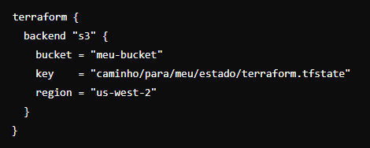

# VM na AWS com VPC utilizando remote state no Terraform
Este projeto fornece um exemplo de como criar uma máquina virtual (VM) na AWS dentro de uma VPC utilizando o Terraform, com o estado armazenado remotamente.

# Visão Geral
Este repositório contém a configuração do Terraform necessária para provisionar uma infraestrutura básica na AWS. A infraestrutura inclui:

* Uma VPC com sub-redes públicas e privadas.
* Uma instância EC2 em uma das sub-redes públicas.
* Utilização do estado remoto para armazenar o estado do Terraform.

# Estrutura do Repositório
* main.tf: Define os recursos principais do projeto.
* outputs.tf: Define as saídas que serão exibidas após a execução do Terraform.
* backend.tf: Configura o estado remoto.

# Pré-requisitos
Antes de começar, você precisará das seguintes ferramentas instaladas:

* Terraform
* AWS CLI

Além disso, você deve configurar suas credenciais AWS, que podem ser feitas utilizando o comando aws configure.

# Configuração
Backend Remoto
Certifique-se de configurar o backend remoto corretamente no arquivo backend.tf:

# Uso

 * Crie uma chave de acesso.
 $ ssh-keygen -f aws-key

1 - Clone o repositório:
$ git clone https://github.com/jf-lacerda/Remote_state-with-aws_vm_vpc
cd AWS-VM-com-VPC-remote-state

2 - Inicialize o Terraform:
$ terraform init

3 - Planeje a infraestrutura:
$ terraform plan

4 - Aplique as mudanças para criar a infraestrutura:
$ terraform apply

5 - Para destruir a infraestrutura, use:
$ terraform destroy

# Problemas Comuns
Erro: Unable to find remote state
Se você encontrar o erro Unable to find remote state, verifique:

As configurações do backend no backend.tf.
O workspace atual usando terraform workspace show.
As permissões AWS para acessar o bucket S3.
Contribuição
Contribuições são bem-vindas! Sinta-se à vontade para abrir issues ou enviar pull requests.

# Licença
Este projeto é licenciado sob a Licença MIT - veja o arquivo LICENSE para mais detalhes.

# Resource: aws_key_pair
https://registry.terraform.io/providers/hashicorp/aws/latest/docs/resources/key_pair

# file Function
https://developer.hashicorp.com/terraform/language/functions/file

# Backend
https://developer.hashicorp.com/terraform/language/settings/backends/s3#data-source-configuration

# Resource: aws_instance
https://registry.terraform.io/providers/hashicorp/aws/latest/docs/resources/instance#argument-reference

